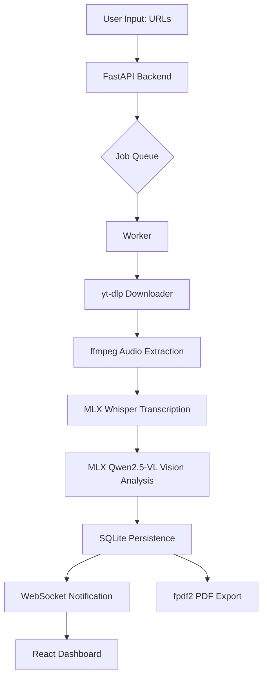

# 🎬 Reel Analyser

A premium, local-first video analysis platform designed for Apple Silicon. Extract transcripts, step-by-step tutorials, and detailed insights from Instagram Reels, YouTube Shorts, and TikTok videos using state-of-the-art MLX models.

## 🌊 System Architecture



## 🌟 Features

- **Multi-Platform Support**: Native handling of Instagram Reels, YouTube Shorts, and TikTok URLs.
- **Local AI Processing**: Uses `mlx-whisper` for transcription and `Qwen2.5-VL` (via `mlx-vlm`) for visual analysis—all running locally on your GPU.
- **Batch Processing**: Paste multiple links at once; the system queues them for sequential processing to optimize memory.
- **Live Updates**: Real-time progress tracking via WebSockets.
- **PDF Export**: Generate professional PDF reports of your video analyses.
- **Glassmorphism UI**: A sleek, modern React-based dashboard.

## 📋 Prerequisites

- **Hardware**: Mac with Apple Silicon (M1, M2, M3, M4). 16GB+ RAM recommended.
- **Software**:
  - Python 3.9 or higher
  - Node.js & npm (for the frontend)
  - [FFmpeg](https://ffmpeg.org/): Required for audio extraction.
  - [yt-dlp](https://github.com/yt-dlp/yt-dlp): Required for video downloads.

## 🛠️ Installation

### 1. Clone the repository
```bash
git clone <your-repo-url>
cd "Reel analyser"
```

### 2. Install System Dependencies (macOS)
```bash
brew install ffmpeg yt-dlp
```

### 3. Setup Backend
```bash
python3 -m venv venv
source venv/bin/activate
pip install -r requirements.txt
```

### 4. Setup Frontend
```bash
cd frontend
npm install
cd ..
```

## 🚀 Running the App

You can use the provided startup script which handles both the backend and frontend:

```bash
chmod +x start.sh
./start.sh
```

Alternatively, run them in separate terminals:

**Backend:**
```bash
source venv/bin/activate
uvicorn backend.main:app --host 0.0.0.0 --port 8000
```

**Frontend:**
```bash
cd frontend
npm run dev
```

The app will be available at `http://localhost:5173`.

## 📂 Project Structure

- `backend/`: FastAPI server, database logic, and ML pipeline workers.
- `frontend/`: React + Vite dashboard.
- `data/`: Storage for downloaded videos, extracted audio, and the SQLite database.
- `requirements.txt`: Python dependencies.

## 🛡️ License
MIT

---
Built with 🖤 for creators.
